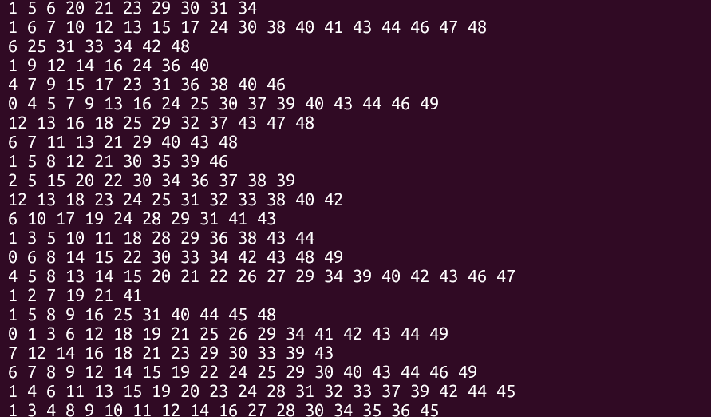
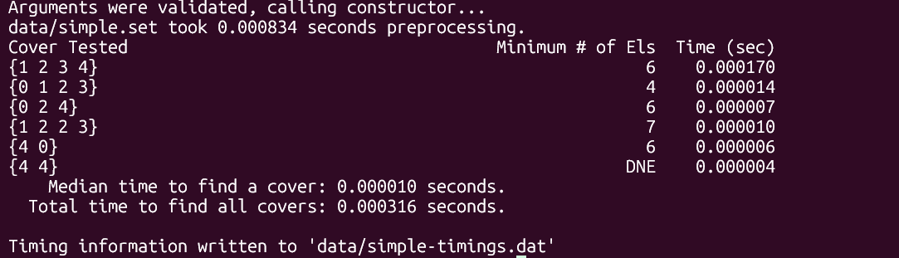

[Back to Portfolio](./)

Minimum Set Finder
===============

-   **Class:** Data Structures Anylisis
-   **Grade:** A
-   **Language(s):** C++
-   **Source Code Repository:** [krabbenhoft/csci-315-project-3](https://github.com/Krabbenhoft/csci-315-project-3)  
    (Please [email me](mailto:isaac.krabbenhoft@gmail.com?subject=GitHub%20Access) to request access.)

## Project description

This project is a highly performant algorithim for finding the minimum set of sets needed to contain all of the ellements in a given set. Duplicates are allowed to occur in both the given set to build a spanning set of sets for and in the sets used to build the spanning set of sets. This makes things much slower because you cannot treat the presence or absense of ellements as a binary value. Treating presence and absense as a binary value for an initial pass would be a usefull optimization for longer searches. I am also concerned to make sure that the vector subtraction is using SIMD. I need to do more research to see if it is or not. This could be a major optimization.

One thing I attempted was to use eight bit integers to fit more in cache and avoid cache misses. In the end though, performance was destroyed by integer promotions and it was three times slower. It was a tough lesson to learn, but I won't make that mistake again.

## How to compile and run the program

How to compile (if applicable) and run the project.

```bash
make run
```

## Implementation

This program does not take any user input directly. Data is read in from the ./data directory. Each line contains one list of space delimited integers that is a canidate for the spanning set of sets for the given input. Test inputs are hardcoded.

  
Fig 1. Sample data.

  
Fig 2. Successful execution.

[Back to Portfolio](./)