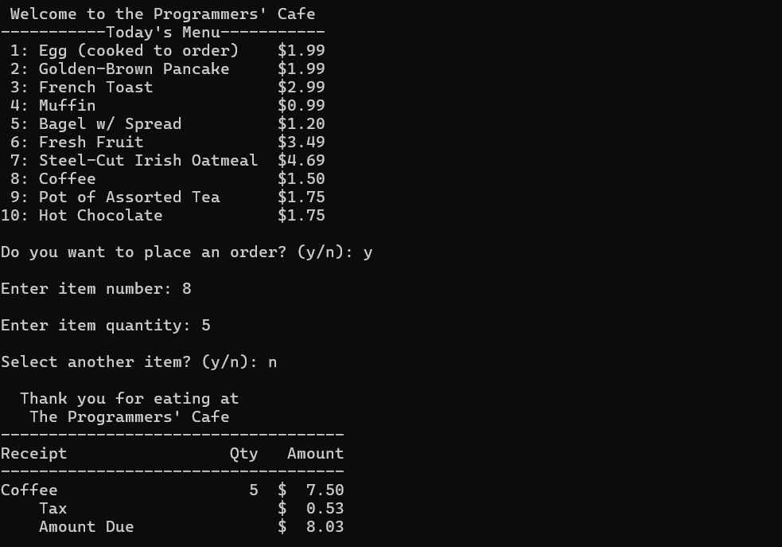
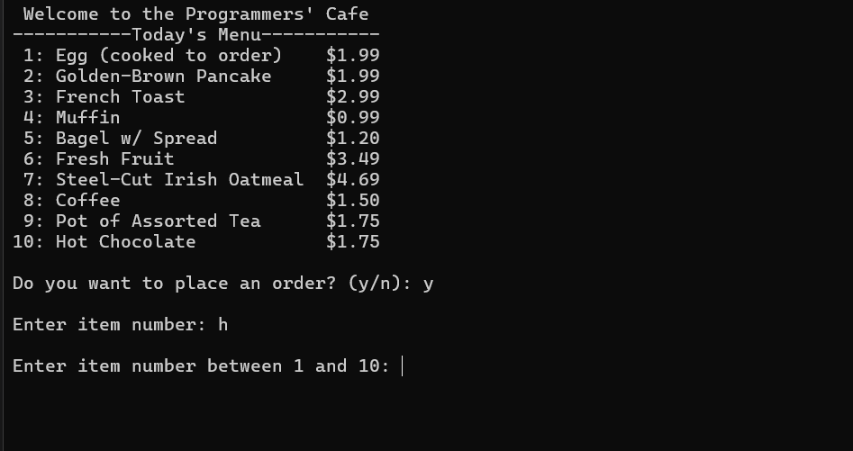

[Back to Portfolio](./)

Project 1 Title
===============

-   **Class:** Procedural Programming
-   **Grade:** A
-   **Language(s):** C++
-   **Source Code Repository:** [features/mastering-markdown](https://github.com/Krabbenhoft/csci-235)  
    (Please [email me](mailto:isaac.krabbenhoft@gmail.com?subject=GitHub%20Access) to request access.)

## Project description

This project calculates the total due given some list of items that a user would like to purchase from a website. It handles all of the IO via the CLI in a loop.

## How to compile and run the program

How to compile (if applicable) and run the project.

```bash
g++ *.cpp
./*.out
```
## Implementation

The program prompts the user for what they would like to purchase and then prints a recipt.

  
Fig 1. Normal control flow.

  
Fig 3. Feedback when an error occurs.

## 3. Additional Considerations

Sed ut perspiciatis unde omnis iste natus error sit voluptatem accusantium doloremque laudantium, totam rem aperiam, eaque ipsa quae ab illo inventore veritatis et quasi architecto beatae vitae dicta sunt explicabo. 

For more details see [GitHub Flavored Markdown](https://guides.github.com/features/mastering-markdown/).

[Back to Portfolio](./)