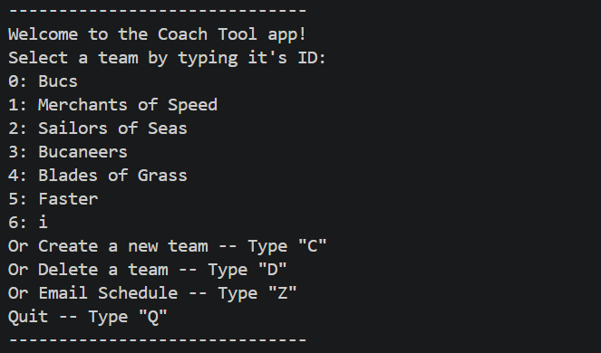
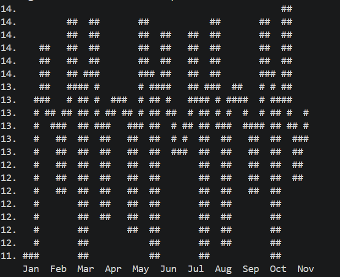
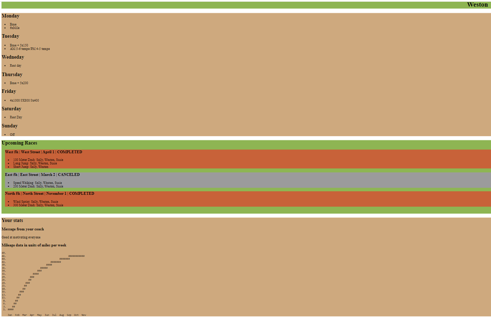

[Back to Portfolio](./)

The Coach Tool App
===============

-   **Class:** Object Oriented Programming
-   **Grade:** A 
-   **Language(s):** Java
-   **Source Code Repository:** [krabbenhoft/the-coach-tool-app](https://github.com/Krabbenhoft/TheCoachToolApp)  
    (Please [email me](mailto:example@csustudent.net?subject=GitHub%20Access) to request access.)

## Project description

This project is a track team manager. It allows the manager of a set of track teams to manage the players on each team, what workouts they need to do, and what their meet schedules are. My part of the project was to add programmatic email generation, disc persistence, most of the CLI, and to write a highly-flexible CLI charting algorithim.

## How to compile and run the program

How to compile (if applicable) and run the project.

```bash
cd ./TheCoachToolApp/TheCoachToolApp/src
javac thecoachtoolapp/*.java
jar -cvfm compiled_code.jar META-INF/MANIFEST.MF thecoachtoolapp/*.class
mv src/compiled_code.jar .
java -jar compiled_code.jar
```

## Implementation

The application allows for the user to do CRUD on runners, teams, workouts, and meets. Everything is saved immediately to the disc. There are two menus, one overall menu and one for managing a specific team.

  
Fig 1. The launch screen

  
Fig 2. Displaying a user's information, including the mileage chart I supplied.

  
Fig 3. Rendered HTML of email I generated.

[Back to Portfolio](./)