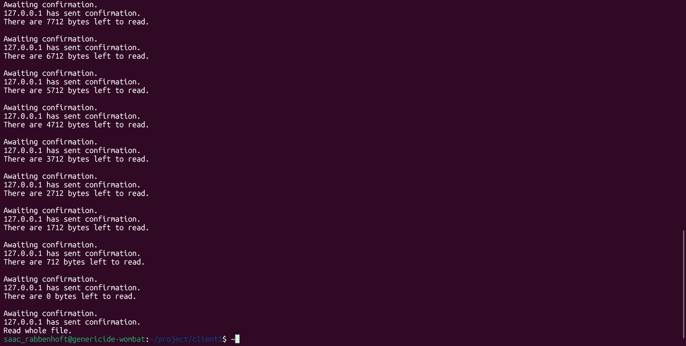
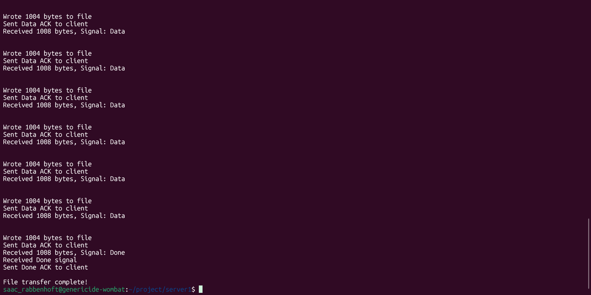

[Back to Portfolio](./)

File Server
===============

-   **Class:** Applied Networking
-   **Grade:** A
-   **Language(s):** C++
-   **Source Code Repository:** [krabbenhoft/applied-networking-file-server](https://github.com/Krabbenhoft/applied-networking-file-server)  
    (Please [email me](mailto:isaac.krabbenhoft@gmail.com) to request access.)

## Project description

This application consists of a client and a server. They transfer files in batches of 1000 bytes. There are metadata fields sent alongside the files in fixed indices that indicate whether the transfer is complete or not.

## How to compile and run the program

How to compile (if applicable) and run the project.

```bash
cd client
g++ *.cpp && ./*.out
cd ..
cd server
g++ *.cpp && ./*.out
```

## Implementation

The user CLI interface for this project is very minimal. Users must only specify the IP and port to connect to. The client must also specify which file name to transfer.

  
Fig 1. The server view.

  
Fig 2. The client view.

[Back to Portfolio](./)