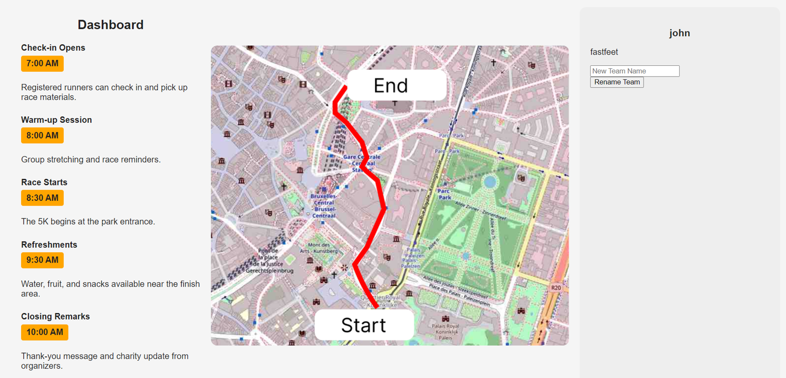
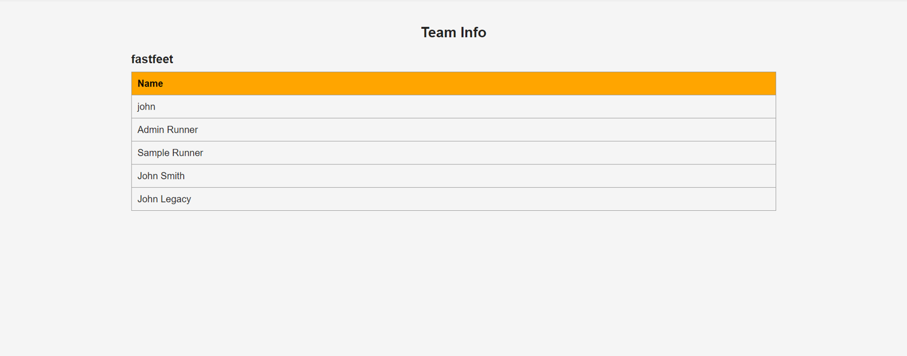

[Back to Portfolio](./)

Charity Run Website
===================

-   **Class:** User Interface Programming
-   **Grade:** A
-   **Language(s):** JavaScript, CSS
-   **Source Code Repository:** [krabbenhoft/team-website-public](https://github.com/Krabbenhoft/team-website-public)  
    (Please [email me](mailto:isaac.krabbenhoft@gmail.com) to request access.)

## Project description

This website is for a charity dedicated to saving starving ugandan children. It has public, user facing, and admin facing views. The backend for the project was provided by Dr. Sun. Users can register, login, and view and modify what team they are on. Admins can update who is an admin.

## How to compile and run the program

You will need to run the frontend and backend seperately. Development works on windows.

Run the frontend.
```bash
npm run dev
```

Run the backend.
```bash
dotnet run
```

## Implementation

While we already had the backend, we needed to design and build the whole frontend. I was responsible for the homepage and also helped to debug and implement some other functionality at the last minute. The home page of the website is meant to motivate sign ups. The user view provides a clear indication of all of the important information. The team view preserves privacy by only displaying names.

  
Fig 1. User dashboard view.

  
Fig 2. User team view.

[Back to Portfolio](./)